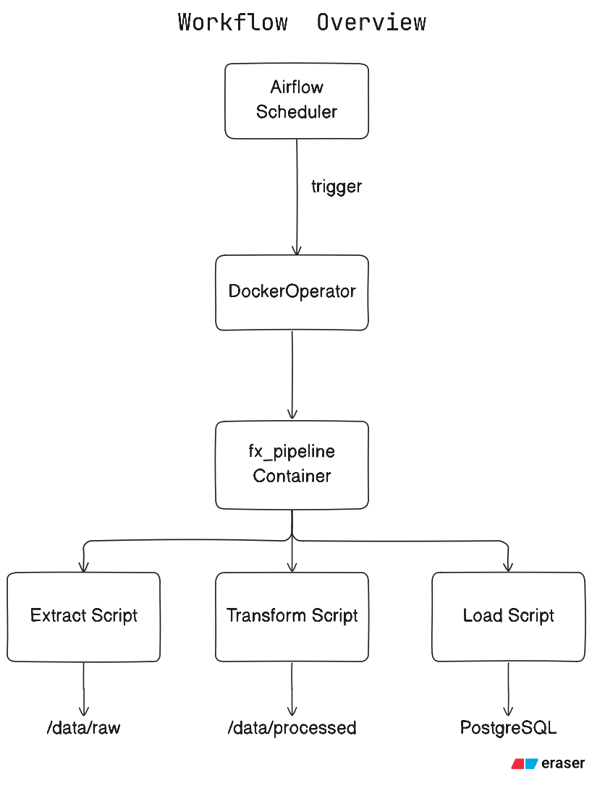

# What is it?
A production style, fully containerized data pipeline that ingests foreign exchange rate data from a live API, enforces strict schema contracts, persists raw and processed data and loads processed data into PostgreSQL. This pipeline is orchestrated using Apache Airflow and runs inside isolated Docker Containers.

## What does it do?
On each run:
- Runs the DAG from airflow at 00:00
- DockerOperator triggers fx_pipeline:latest image
- The image runs the ETL Scripts
- Writes raw and processed data to the mounted local directories /data/raw, /data/processed
- Loads the processed dataframe into local PostgreSQL
- Supports safe reruns with no risk of duplicating and corrupting data.

## Architecture Overview:


This pipeline was designed with reliability in mind meaning you could run this with your eyes closed and it would run or fail loudly if something's wrong.

### Dataset grain:
One row of the table rates represents FX rate for (base currency, target currency) on a specific date. Base currency here being USD.

*This is a daily snapshot dataset, not intraday (yet)*

### Table Schema:
```sql
CREATE TABLE rates (
    date        TIMESTAMPTZ NOT NULL,
    base        TEXT        NOT NULL,
    target      TEXT        NOT NULL,
    rates       DOUBLE PRECISION NOT NULL,
    fetch_time  TIMESTAMP   NOT NULL,
    PRIMARY KEY (date, base, target)
);
```
## Rerun and Idempotency:
This pipeline was designed to be append only. Here the primary key is (date, base, target) where inserts use `ON CONFLICT (date,base,target) DO NOTHING` this make sure reruns on the same day doesn't overwrite the date and duplicates are never created.

## Project Structure:
```
fx_pipeline/
│
├── src/
│   ├── extract.py
│   ├── transform.py
│   ├── load.py
│   ├── config.py
│   └── main.py
│
├── docker/
│   └── airflow/
│       ├── docker-compose.yaml
│       ├── .env.example
│       └── dags/
│           └── fx_dag.py
│
├── data/
│   ├── raw/
│   └── processed/
│
├── Dockerfile
├── requirements.txt
├── .env.example
└── README.md
```

## Where it fails:
- Missing API Key in Docker env = extract.py fail
- Invalid/Null data = transform.py fail
- DB Unavailable = load.py fails (unless setup.py is run)
- Duplicate inserts = ignored by load.py

## Secrets:
- API keys are read from environment variable in the docker's .env file
- No secrets are hardcoded
- local .env is ignored by git

 \#\# How to run? (Locally)

1) Build Pipeline Image
```bash
docker build -t fx_pipeline .
```
2) Start Airflow
```bash
cd docker/airflow
docker compose up -d
```
3) Set env variables
- Add your API key in docker/airflow/.env

4) Access Airflow UI
```bash
http://localhost:8080
```
5) Trigger DAG:
```bash
fx_dag
```

## Features Implemented:
- Containerized ETL Pipeline
- Airflow orchestration using DockerOperator
- Idempotent database loads
- Immutable raw data storage
- Schema Enforcement
- Environment based secret management
- Full reproducible

## Future Improvements:
- Cloud Deployment (AWS EC2)
- Backfill capability
- Object storage Integration (S3)
- Container registry deployment
